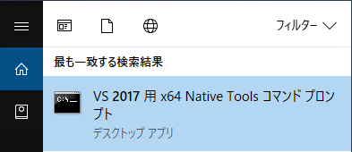

# Windows MSVC：C/C++コンパイラを実行する方法

本書の12章ではC言語で書いたプログラムをコンパイルするために、コマンドプロンプトやPowerShellのプロンプトからC/C++コンパイラを実行します。
Windows MSVCのC/C++コンパイラ（`cl.exe`）を実行するために、MSVC環境へPathを通す方法を説明します。

<!-- TODO: Visual Studio 2019の動作を確認する -->

## コマンドプロンプトを使う場合

本書執筆時点で最新版だったVisual Studio 2017を使って説明します。

スタートメニューでキーワード「2017」で検索し、表示された「VC 2017 用 x64 Native Tools コマンドプロンプト」をクリックします。



コマンドプロンプトが起動し、Pathなどの環境変数が自動的に設定されます。
試しにコンパイラを実行してみましょう。
以下のようにバージョン情報と使い方（usage）が表示されるはずです。

```
C:\Program Files (x86)\Microsoft Visual Studio\2017\BuildTools> cl
Microsoft (R) C/C++ Optimizing Compiler Version 19.16.27027.1 for x64
Copyright (C) Microsoft Corporation.  All rights reserved.

usage: cl [ option... ] filename... [ /link linkoption... ]
```

## PowerShellを使う場合

PowerShellではPscxモジュールを使うのが簡単です。

- https://www.powershellgallery.com/packages/Pscx

### Pscxモジュールのインストール

まず以下のコマンドを実行し、PowerShellでスクリプトを実行できるように設定します。

```
PS> Set-ExecutionPolicy RemoteSigned -Scope CurrentUser
```

続いてPscxと関連するモジュールをインストールします。

```
PS> Install-Module -Name VSSetup -Scope CurrentUser
PS> Install-Module -Name Pscx -Scope CurrentUser -AllowClobber
```

### Pscxモジュールを使用してMSVC環境へPathを通す

C++コンパイラを使う際は以下のコマンドを実行します。
これによりPathなどの環境変数が設定されます。
`2017`のところは、お使いのVisual Studioバージョンに合わせて書き換えてください。

```
PS> Import-VisualStudioVars 2017 amd64
```

コンパイラを実行してバージョン情報などが表示されることを確認します。

```
C:\Users\user-name> cl
Microsoft (R) C/C++ Optimizing Compiler Version 19.16.27027.1 for x64
Copyright (C) Microsoft Corporation.  All rights reserved.

usage: cl [ option... ] filename... [ /link linkoption... ]
```
